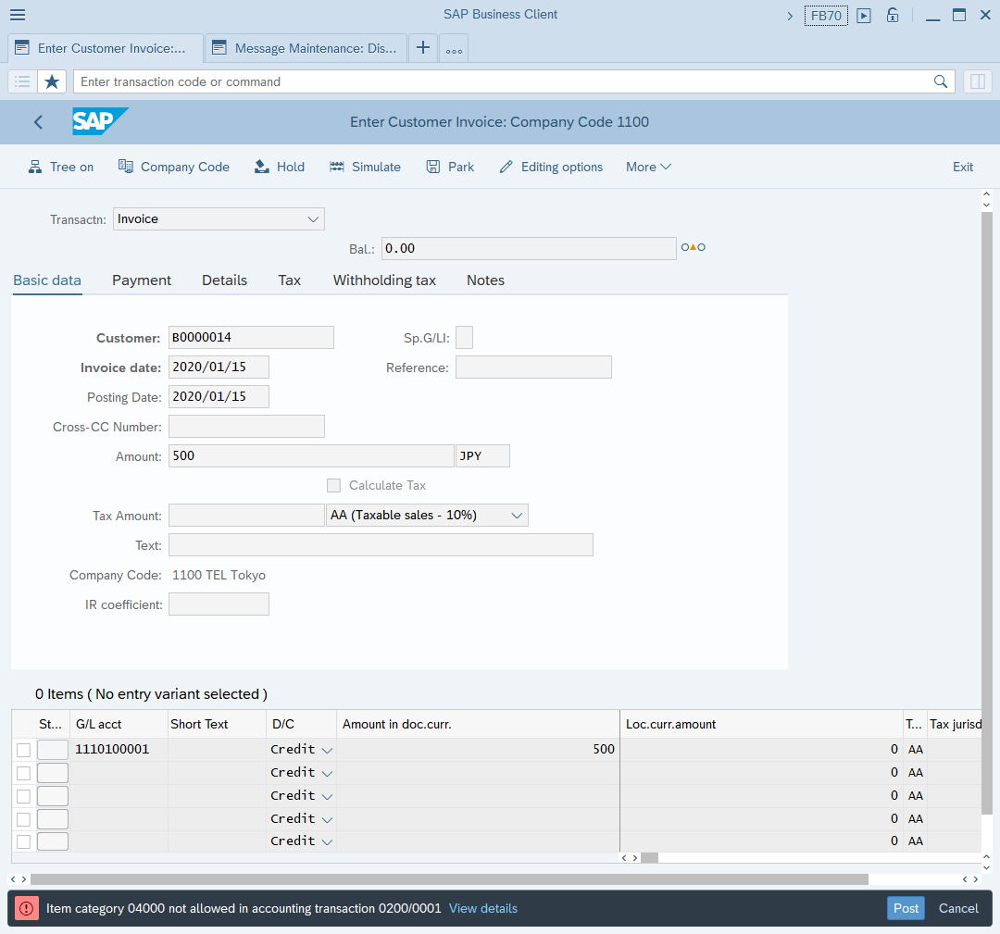
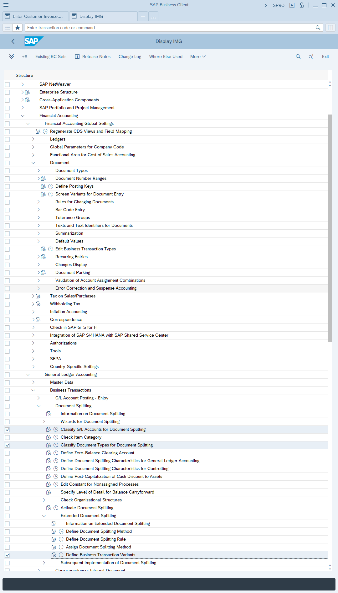
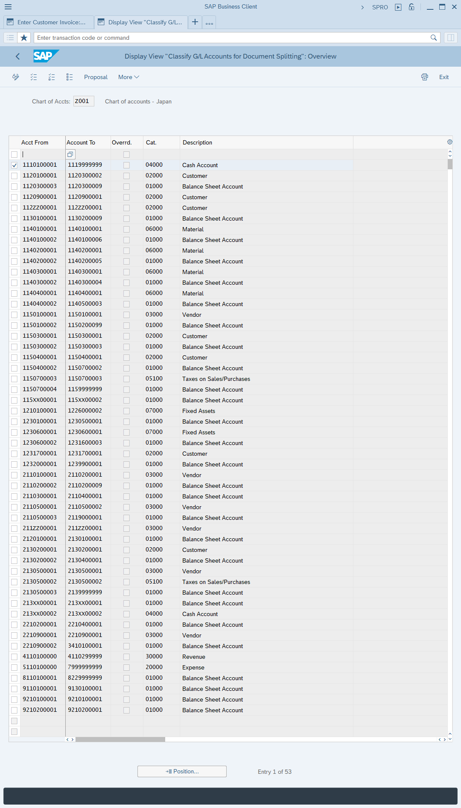
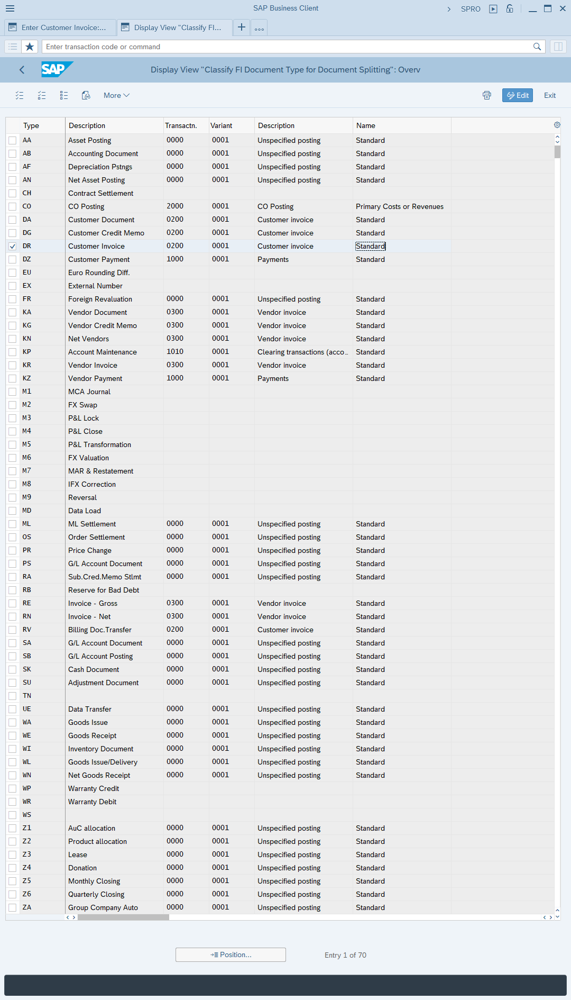
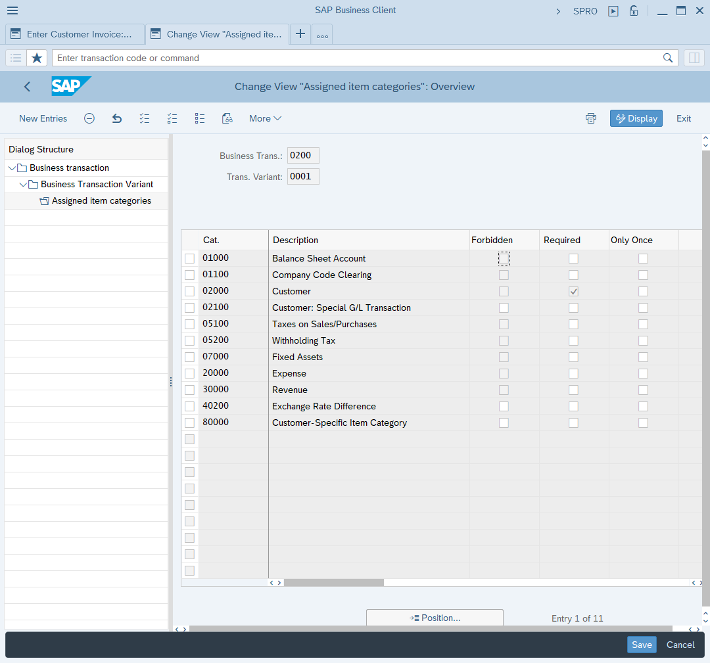

# Problems and Solutions
*created on 2020/1/15 by LiuYueyao*

## Item category &1 not allowed in accounting transaction &2/&3
##### PROBLEM: Message no. GLT2001, error at document posting  

##### REASON: go to SPRO

* Classify G/L Accounts for Document Splitting  
 *account 1110100001 is assigned to category 04000*

* Classify Document Types for Document Splitting  
 *document type DR mapping transaction 0200 and variant 0001*

* Define Business Transaction Variants  
 *category 04000 is not in transaction 0200 variant 0001*

##### SOLUTION: change IMG config, or pick another G/L account
